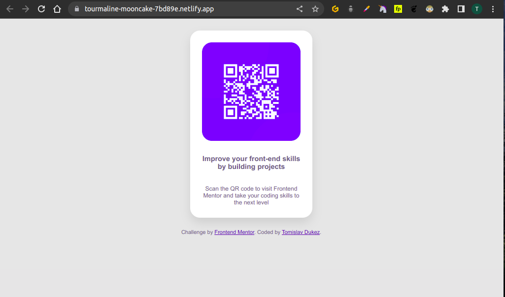

# Frontend Mentor - QR code component solution

This is a solution to the [QR code component challenge on Frontend Mentor](https://www.frontendmentor.io/challenges/qr-code-component-iux_sIO_H). Frontend Mentor challenges help you improve your coding skills by building realistic projects.

## Table of contents

- [Overview](#overview)
  - [Screenshot](#screenshot)
  - [Links](#links)
- [My process](#my-process)

  - [Built with](#built-with)
  - [What I learned](#what-i-learned)

- [Author](#author)

## Overview

### Screenshot

### Links

- Solution URL: [Add solution URL here](https://www.frontendmentor.io/challenges/qr-code-component-iux_sIO_H/hub)
- Live Site URL: [Add live site URL here](https://tourmaline-mooncake-7bd89e.netlify.app/)

## My process

I redesigned the html body into two divs. In the first one I separeted the text into h1 and paragraph tags. I added an image at the top of the first div. Then I changed the style.

### Built with

- Semantic HTML5 markup
- CSS custom properties
- Mobile-first workflow

### What I learned

I learned how to easily make a simple and nice design without to many lines of code.

## Author

- Tomislav Dukez / Frontend Mentor - [@tomdu3](https://www.frontendmentor.io/profile/@tomdu3)
